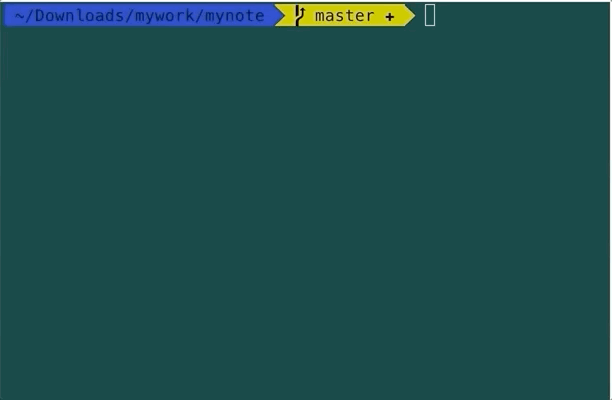
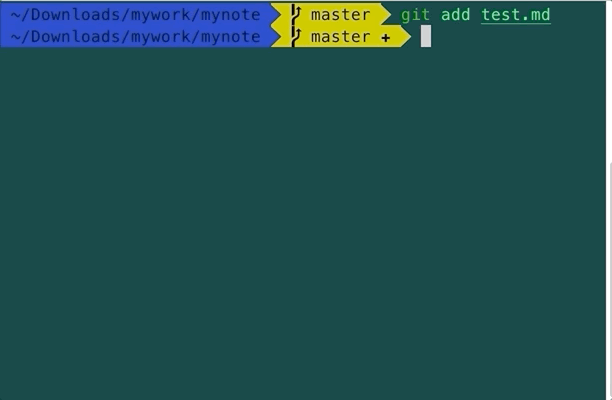
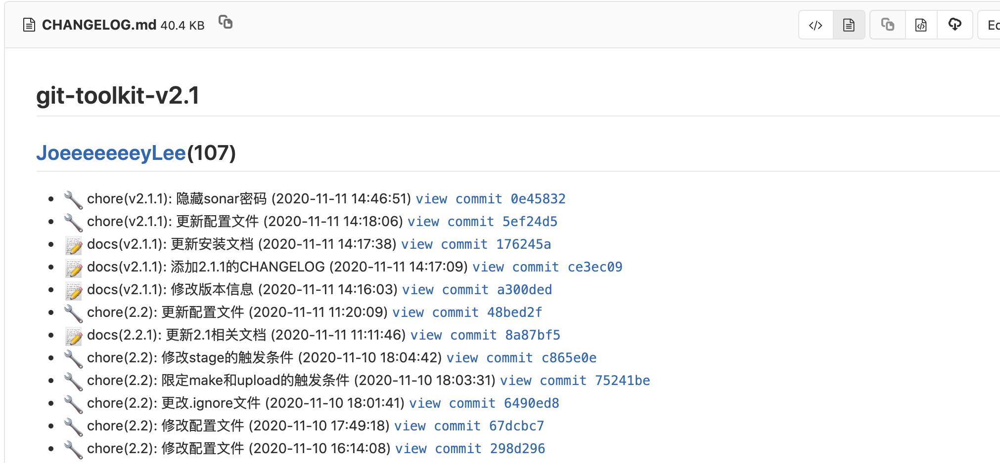
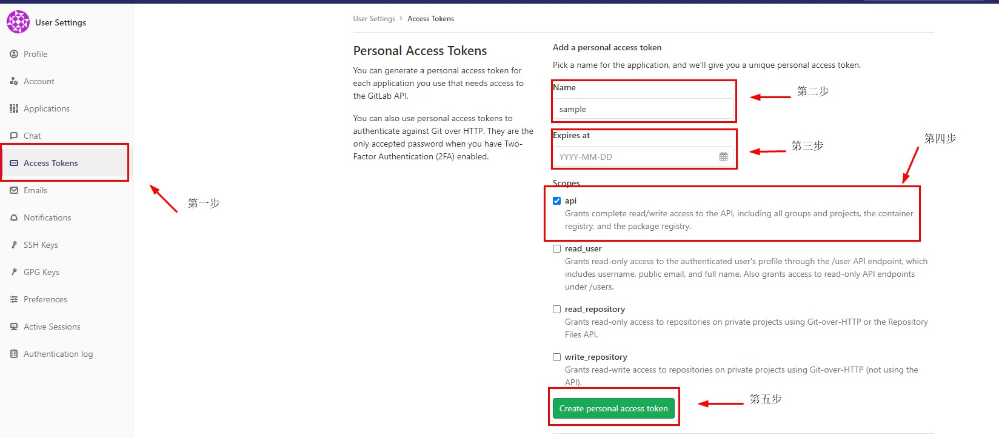

# 使用介绍

## 1. 自定义命令

| **Commands**  | **Description**                                                                                        |
| --            | --                                                                                                     |
| **branch**    | 创建分支的相关命令                                                                                        |
| `feat`        | 创建`feat`分支，接受一个字符串，并创建一个`feat`分支，分支名称格式为 `feat/xxx`                                  |
| `fix`         | 创建`fix`分支，接受一个字符串，并创建一个`fix`分支，分支名称格式为 `fix/xxx`                                     |
| `docs`        | 创建`docs`支，接受一个字符串，并创建一个`docs`分支，分支名称格式为 `docs/xxx`                                   |
| `style`       | 创建`style`分支，接受一个字符串，并创建一个`style`分支，分支名称格式为 `style/xxx`                               |
| `refactor`    | 创建`refactor`分支，接受一个字符串，并创建一个`refactor`分支，分支名称格式为 `refactor/xxx`                      |
| `chore`       | 创建`chore`分支，接受一个字符串，并创建一个`chore`分支，分支名称格式为 `chore/xxx`                               |
| `perf`        | 创建`perf`分支，接受一个字符串，并创建一个`perf`分支，分支名称格式为 `perf/xxx`                                  |
| `design`      | 创建`desgin`分支，接受一个字符串，并创建一个`desgin`分支，分支名称格式为 `desgin/xxx`                            |
| `hotfix`      | 创建`hotfix`分支(通常用于对`master`紧急修复) ，接受一个字符串，并创建一个`hotfix`分支，分支名称格式为 `hotfix/xxx`  |
| **commit**    | 提交的相关命令                                                                                            |
| `ci`          | 提供交互式`git commit`的命令，用于定制统一的`commit message`                                                 |
| `cm`          | 检查`commit message`是否符合规范                                                                          |
| **push**      | 推送的相关命令                                                                                            |
| `ps`          | 等同于`git push origin current_branch`                                                                  |
| **CHANGELOG** | 日志的相关命令                                                                                            |
| `clog`        | 输出`git`的`change`日志                                                                                  |
|**MergeRequest**|`Merge Request`的相关命令                                                                                |
| `cmr`          | 创建指定项目的`MR`                                                                                      |
| `umr`          | 更新指定项目的某个`MR`                                                                                   |
| `dmr`          | 删除指定项目的某个`MR`                                                                                   |
| `amr`          | 合并指定项目的某个`MR`                                                                                   |
| `gmr`          | 获取指定项目的`MR`引起的改变                                                                              |

## 2. `gitlab`与`jira`进行关联

### 2.1.  首先需要在项目中进行配置  

### 2.2.  具体使用流程

+ **动图演示**

    1)与`gitlab`中的`issue`进行绑定  
    

    2)与`jira`中的`issue`进行绑定  
    

+ **代码演示**

+ 与`gitlab`中的`issue`进行绑定的代码演示

    ```bash
    git add .
    git ci
    » Type: docs
    » Scope(本次提交的范围，建议填写版本号): <version-id> v1.0
    » Subject(请添加简短的、必要的对本次提交的描述): gitlab与jira进行绑定
    » Body(添加一个完整提交描述):
    » Footer(列出本次解决的、可以关闭的所有问题，建议使用关键字refs、close): refs PYLON-371
    [master 4b4db84] :pencil: docs(v1.0): gitlab与jira进行绑定
     1 file changed, 1 insertion(+)
    git ps
    ```

+ 与`jira`中的`issue`进行绑定的代码演示

    ```bash
    git add .
    git ci
    » Type: docs
    » Scope(本次提交的范围，建议填写版本号): <version-id> v1.0
    » Subject(请添加简短的、必要的对本次提交的描述): 添加测试文档
    » Body(添加一个完整提交描述): big #如果想输入较多的commit信息，可以输入big打开编辑器进行编辑
    » Footer(列出本次解决的、可以关闭的所有问题，建议使用关键字refs、close): refs #1
    [master 915326e] :pencil: docs(v1.0): 添加测试文档
     1 file changed, 1 insertion(+)
    git ps
    ```

### 注意

1) 当`issue`在`jira`中的时候，此时`issue-id`前的`#`不是必须的，推荐不要加#；而当`issue`在`gitlab`中的时候，必须在对应的`issue-id`前面加上`#`，否则不会进行相应的关联；
2) 当需要关联多个`issue`的时候，使用如下格式的`Footer`即可，`refs #issue/1 #issue/2 ... #issue/N`

## 3. `git ci`命令的使用—自动读取版本信息

**注意：如果想要使用这个功能，需要在项目提交目录下面存在名为`version`的文件，此时没有文件扩展名。**

+ **动图演示**
  
### 3.1.  `version`中的版本号是这次提交涉及的版本


### 3.2.  `version`中的版本号不是这次提交涉及的版本，指定其它版本  


## 4. 替换历史`commit`的邮箱的`git repl`命令的使用

+ **使用示例**

### 4.1.  将历史`commit`中的`old1@example.com` `old2@example.com` `old3@example.com`邮箱全部替换为`user@yourcompany.com`

**如果之前已经进行过替换操作，那么会报如下错误，此时使用本命令需要加上`-f`参数，即可**

```bash
Cannot create a new backup.
A previous backup already exists in refs/original/
Force overwriting the backup with -f
exit status 1
```

```bash
git repl qq@qq.com 163@163.com gmail@gmail.com user@yourcompany.com

WARNING: git-filter-branch has a glut of gotchas generating mangled history
rewrites.  Hit Ctrl-C before proceeding to abort, then use an
alternative filtering tool such as 'git filter-repo'
(https://github.com/newren/git-filter-repo/) instead.  See the
filter-branch manual page for more details; to squelch this warning,
set FILTER_BRANCH_SQUELCH_WARNING=1.
Proceeding with filter-branch...  
Rewrite ec436a0e61497c22335495a7f3fb19c3cb98ebb0 (1/1) (0 seconds passed, remaining 0 predicted)
WARNING: Ref 'refs/heads/master' is unchanged
```

### 4.2.  将历史`commit`中的提交者为`luo`，`sun`，`zhao`的`commit`的提交者修改为`li`，此时需要加上`li`的邮箱地址

```bash
git repl luo sun zhao li li@email.com

WARNING: git-filter-branch has a glut of gotchas generating mangled history
    rewrites.  Hit Ctrl-C before proceeding to abort, then use an
    alternative filtering tool such as 'git filter-repo'
    (https://github.com/newren/git-filter-repo/) instead.  See the
    filter-branch manual page for more details; to squelch this warning,
    set FILTER_BRANCH_SQUELCH_WARNING=1.
Proceeding with filter-branch...
Rewrite ec436a0e61497c22335495a7f3fb19c3cb98ebb0 (1/1) (0 seconds passed, remaining 0 predicted)
WARNING: Ref 'refs/heads/master' is unchanged
```

## 5.  使用配置文件针对指定仓库进行邮箱地址检查

### 5.1.  当没有`config.yaml`时

推送代码到指定仓库时，会限定邮箱为特定域名；推送代码到别的远程仓库则无限制

### 5.2.  当有`config.yaml`时，下面为示例代码

```yaml
verify:
  github.com:
    - yourcompany.com
  gitlab.com:
    - qq.com
    - yourcompany.com
```

上面的配置文件对两个远程仓库进行限制，限定`github.com`仓库的提交邮箱为`yourcompany.com`，限定`gitlab.com`仓库的提交邮箱为`yourcompany.com`和`qq.com`

## 6. 生成当前版本的`CHANGELOG`

### 6.1.  使用  

`git clog tag`:仅生成当前tag的CHANGELOG，并将结果保存在执行目录下的CHANGELOG.md文件中；  
`git clog ..tag`:生成当前tag到最早的tag的CHANGELOG，并将结果保存在执行目录下的CHANGELOG.md文件中；  
`git clog tag..`:生成当前tag到最新的tag的CHANGELOG，并将结果保存在执行目录下的CHANGELOG.md文件中；  
`git clog oldTag..newTag`:生成oldTag到newTag的CHANGELOG，并将结果保存在执行目录下的CHANGELOG.md文件中；  
`git clog tag -o tmp/CHANGELOGTag.md`仅生成当前tag的CHANGELOG，并将结果保存在执行目录下tmp目录的CHANGELOGTag.md文件中；  
**注意当输入的地址是绝对路径时，必须是当前项目的根目录或者它的子目录中**

### 6.2.  `CHANGELOG`  



## 7.  通过`git-toolkit`使用`MR`相关命令

### 7.1.  创建MR

```bash
git cmr
» Title(请添加本次MR提交的标题) cmr
» Description(请添加简短的、必要的对本次MR的描述) cmr
» TargetBranch(请添加本次MR的目标分支) master
» Label(请添加本次MR的标签) feature document
» AssigneeID(请添加本次MR的分配者) dengtao
» AssigneeIDs(请添加本次MR的多个分配者) dengtao
» MilestoneID(请添加本次MR的Milestone ID)
» RemoveSourceBranch(请确定本次MR是否要移除源分支) true
» Squash(请确定本次MR是否要压缩commit) false
» AllowCollaboration(请确定本次MR是否要采用合作模式) false
```

### 7.2.  更新MR

```bash
git umr
» MergeRequestID(请添加MR的MergeRequestID) 27
» Title(请添加本次MR提交的标题) umr
» Description(请添加简短的、必要的对本次MR的描述) umr
» TargetBranch(请添加本次MR的目标分支) master
» Label(请添加本次MR的标签) feature
» AddLabels(请添加本次MR要新增的标签) test
» RemoveLabels(请添加本次MR要删除的标签) document
» AssigneeID(请添加本次MR的分配者) dengtao
» AssigneeIDs(请添加本次MR的多个分配者)
» MilestoneID(请添加本次MR的Milestone ID)
» StateEvent(请添加本次MR状态，reopen or close) reopen
» RemoveSourceBranch(请确定本次MR是否要移除源分支) false
» Squash(请确定本次MR是否要压缩commit) false
» AllowCollaboration(请确定本次MR是否要采用合作模式) false
» DiscussionLocked(请确定本次MR是否要开启讨论权限) false
```

### 7.3.  删除MR

```bash
git dmr  
» MergeRequestID(请添加MR的MergeRequestID) 27
```

### 7.4.  合并MR

```bash
git amr
» MergeRequestID(请添加MR的MergeRequestID) 27
» MergeCommitMessage(请添加通过MR的备注) accept
» SquashCommitMessage(请添加压缩的Commit的备注) false
» Squash(请确定本次MR是否要压缩commit) false
» RemoveSourceBranch(请确定本次MR是否要移除源分支) false
» MergeWhenPipelineSucceeds(请确定当流水线成功时MR是否会进行合并) false
```

### 7.5.  获取MR的改变

```bash
git gmr  
» MergeRequestID(请添加MR的MergeRequestID) 27
```

### 7.6. 配置

**注意：上述命`5`个令需要`2`个必要的参数，`token`代表你的`Gitlab`的`Access Token`，需要提前设置才可以使用，设置方式如`7.6.1`所示；然后需要在项目的提交目录创建一个名为`config.yaml`文件，其中的`token`格式如`7.6.3`所示。**

### 7.6.1  设置访问令牌



### 7.6.3.  config.yaml文件

```yaml
gitlab:
  token: token
```
